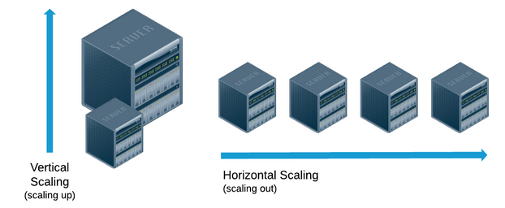
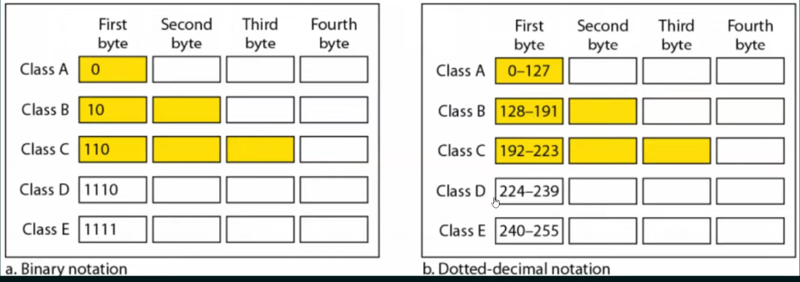

## 💻 Scaling 

#### Horizontal Scaling 
Horizontal Scaling means scaling by adding more machines to your pool of resources. 
Horizontal Scaling helps avoid single point of failure.
Most Common Way of Scaling has less downtime and is more cost effective.


#### Vertical Scaling
Vertical Scaling means scaling by adding more power to an existing machine. 




### IP Addresses

IP Address in Internet Protocol Address is a unique address assigned to each device connected to a computer network that uses the Internet Protocol for communication.
It is in form of Integeric number separated by dots. eg. 198.168.10.26

```
            Addressing
    |-----------------------------|
IP Address `                Mac Address
    
    |                             |

(Logical Addressing)    (physical Addressing)


```

IPV4 has 32 bits and IPV6 has 128 bits.

Private IP Address

Public IP Address

Classful IPV4 Addressing

Network ID and Host ID in IP Addresses

---
class A - N H H H

class B - N N H H

class C - N N N H

class D - Multicast

class E - Experimental

---





#### Links - 

https://www.simplilearn.com/tutorials/cyber-security-tutorial/difference-between-ipv4-and-ipv6

https://www.geeksforgeeks.org/introduction-of-classful-ip-addressing/

Classful IP Addressing - https://www.youtube.com/watch?v=VkgfyLf1raY